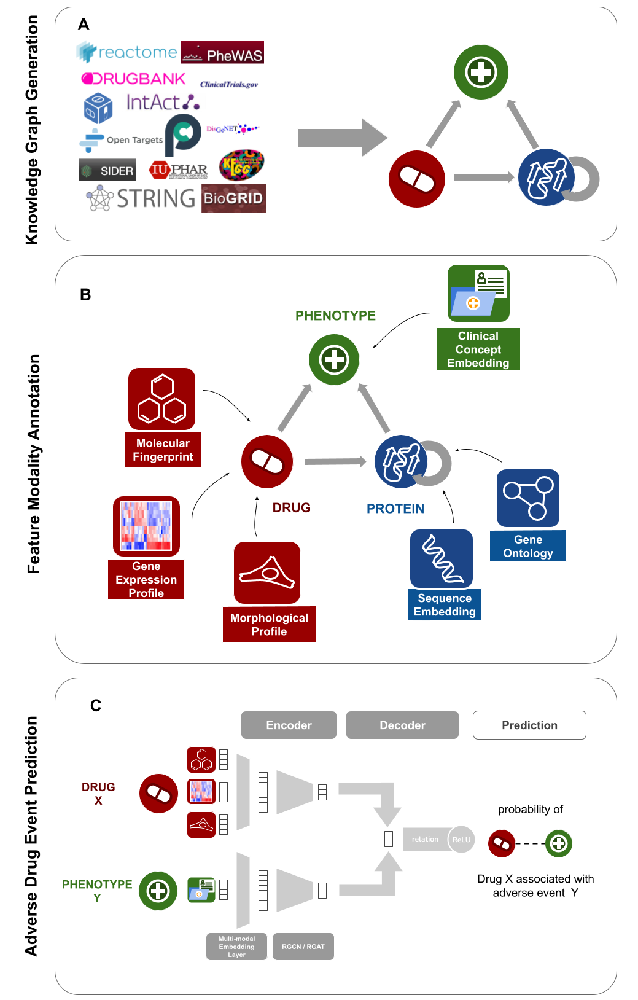

MultiGML: Multimodal Graph Machine Learning for Prediction of Adverse Drug Events


## Table of contents
* [General info](#general-info)
* [Installation](#installation)
* [Documentation](#documentation)
* [Input data](#input-data-formats)
* [Usage](#usage)
* [Issues](#issues)
* [Acknowledgements](#acknowledgements)
* [Disclaimer](#disclaimer)

## General info

Adverse drug events constitute a major challenge for the success of clinical trials. Experimental procedures for measuring liver-toxicity, cardio-toxicity and others are well established in pre-clinical development, but are costly and cannot fully guarantee success in later clinical studies, specifically in situations without a reliable animal model. Hence, several computational strategies have been suggested to estimate the risk associated with therapeutically targeting a specific protein, most prominently statistical methods using human genetics. While these approaches have demonstrated high utility in practice, they are at the same time limited to specific information sources and thus neglects a wealth of information that is uncovered by fusion of different data sources, including biological protein function, protein-protein interactions, gene expression, chemical compound structure, cell based imaging and others. 
In this work we propose an integrative and explainable Graph Machine Learning neural network approach (MultiGML), which fuses knowledge graphs with multiple further data modalities to predict drug related adverse events. MultiGML demonstrates excellent prediction performance compared to alternative algorithms, including various knowledge graph embedding techniques. Furthermore, MultiGML distinguishes itself from alternative techniques by providing in-depth explanations of model predictions, which point towards biological mechanisms associated with predictions of an adverse drug event.

Here is an overview of the workflow of our approach:


Overview of workflow. A) Knowledge Graph compilation. In the first step of data processing, interaction information from 14 biomedical databases was parsed with data on drug-drug interactions, drug-target interactions, protein-protein interactions, indication, drug-ADE and gene-phenotype associations. The data was harmonized across all databases and a comprehensive, heterogeneous, multi-relational knowledge graph was generated. B) Feature definition. Descriptive data modalities were selected to annotate entities in the knowledge graph. Drugs were annotated with their molecular fingerprint, the gene expression profile they cause, and the morphological profile of cells they induce. Proteins were annotated with their protein sequence embedding and a gene ontology fingerprint. Phenotypes, comprising indications and ADEs, were annotated by their clinical concept embedding. C) Proposed MultiGML approach. The heterogeneous Knowledge Graph with its feature annotations is used as the input for our graph neural network approach, the MultiGML. For each node entity, a multi-modal embedding layer learns a low dimensional representation of entity features. These embeddings are then used as input for either the RGCN or RGAT of the encoder (see section 2.2.1), which learns an embedding for each  entity in the KG. A bilinear decoder takes a source and a destination node, drug X and phenotype Y in the example here, and produces a score for the probability of their connection, considering their relation type with each other.

## Installation

We recommend starting from a clean virtual environment since many dependencies will be installed. After creating a new environment, install dependencies from requirements.txt.

The most recent code can be installed from the source on [https://github.com/SCAI-BIO/MultiGML](https://github.com/SCAI-BIO/MultiGML) with:

```
$ python3 -m pip install https://github.com/SCAI-BIO/MultiGML
```

For developers, the repository can be cloned from [https://github.com/SCAI-BIO/MultiGML](https://github.com/SCAI-BIO/MultiGML) and installed in editable mode with:

```
$ git clone https://github.com/SCAI-BIO/MultiGML
$ cd MultiGML
$ python3 -m pip install -e .
```

The file protein_embeddings_esm.tsv.zip was too large to push to GitHub, and therefore was split into segments (protein_embeddings_esm_*). In order to run the code, you need to merge these files together:
```
$ cat protein_embeddings_esm_* > protein_embeddings_esm.tsv.zip
```


## Documentation
Read the [official docs]() for more information.

## Input data formats

### Data


### Knowledge graph

The graph format MultiGML uses is a modified version of the Edge List Format which has several columns for identifying
the source and destination node, their relation and the source database:

| Column name       | Explanation                                   | Example          |
|-------------------|-----------------------------------------------|------------------|
| source_identifier | Identifier of the source node.                | DRUGBANK:DB00001 |
| source_node_type  | Source node type.                             | drug             |
| target_identifier | Identifier of the target node.                | HGNC:3535        |
| target_node_type  | Target node type.                             | protein          |
| relation_type     | Type of the edge.                             | drug-protein     |
| source_database   | Database the edge information was taken from. | DRUGBANK         |

**Note:** The data must be in a tab separated file format & if your knowledge graph does not have relations between the source and the target, just populate the relation column with "No Relation".

### Features

There are three types of nodes in the knowledge graph: drugs, phenotypes and proteins. Each of the node types have specific
node features.


### Data Repository Structure


The repository contains a main data folder ([data](data/)) containing the following folders: [graph](data/graph), [features](data/features) and [data_set_split](data/data_set_split).

The following files are listed in the [features](data/features/full_features/) directory:

* [cui2vec_disgenet.tsv](data/features/full_features/cui2vec_disgenet.tsv): phenotype embeddings for UMLS CUIs

* [drugbank_count_fp.tsv](data/features/full_features/drugbank_count_fp.tsv): compound count fingerprints for Drugbank IDs

* [lincs_drug_fc.tsv](data/features/full_features/lincs_drug_fc.tsv): fold change of protein expression due to perturbation of drugs

* [lincs_cytological_profiling_drug_features.tsv](data/features/full_features/lincs_cytological_profiling_drug_features.tsv): cytological image profiling features of drugs

* [protein_embeddings_esm.tsv](data/features/full_features/protein_embeddings_esm.tsv): protein sequence embeddings 

* [protein_go_fingerprint.tsv](data/features/full_features/protein_go_fingerprint.tsv): gene ontology fingerprint for proteins


## Usage
**Note:** These are very basic commands for MultiGML, and the detailed options for each command can be found in the [documentation](#documentation)


1. **Hyperparameter Optimization**

    The following command applies bayesian hyperparameter optimization and selects the best hyperparameters. Set the argument --use_attention=False for using the MultiGML-RGCN variant, set it to True for using the MultiGML-RGAT variant. Set the --which_features argument to 'full' for using the multimodal features, set it to 'random' for using the basic features.

    ```
    $ python -m multigml linkpredict run-opt --which_graph='complete' --n_trials=1 --use_cuda=False --n_epochs=30 --pruner='hyperband' --max_resource=30 --min_resource=1 --reduction_factor=4 --evaluate_every=1 --n_splits=1 --data_set_split='<repository_path>/multigml/data/data_set_split/extended_trimmed_kg' --eval_edge_type='side-effect' --eval_edge_type_inv='side-effect_inverse' --which_features='full' --average='weighted' --calculate_etype_metrics=False --mlflow_experiment_name='<mlflow_experiment_name>' --optuna_study_name='<optuna_study_name>' --use_attention=False 
    ```

2. **Training**

    The following command trains the model with the best hyperparameters and does link prediction. Set the argument --use_attention=False for using the MultiGML-RGCN variant, set it to True for using the MultiGML-RGAT variant. Set the --which_features argument to 'full' for using the multimodal features, set it to 'random' for using the basic features.

    ```
    $ python -m multigml linkpredict run --which_graph='complete' --use_cuda=False --n_epochs=100 --evaluate_every=1 --n_splits=1 --data_set_split='<repository_path>/multigml/data/data_set_split/extended_trimmed_kg' --eval_edge_type='side-effect' --eval_edge_type_inv='side-effect_inverse' --which_features='full' --average='weighted' --calculate_etype_metrics=True --best_params='<best_params_path>' --mlflow_experiment_name='<mlflow_name>' --test_run=True --use_attention=False

    ```

3. **Testing**

    Use the following command to test your pretrained model. Set the argument --use_attention=False for using the MultiGML-RGCN variant, set it to True for using the MultiGML-RGAT variant. Set the --which_features argument to 'full' for using the multimodal features, set it to 'random' for using the basic features.

    ```
    $ python -m multigml linkpredict run --which_graph='complete' --neg_sample_size=1 --use_cuda=False --batch_size=100 --n_epochs=100  --evaluate_every=1 --n_splits=1 --data_set_split='<repository_path>/multigml/data/data_set_split/extended_trimmed_kg' --verbose=False --eval_edge_type='side-effect' --eval_edge_type_inv='side-effect_inverse' --which_features='full' --average='weighted' --calculate_etype_metrics=True --best_params='<best_params_path>' --mlflow_experiment_name='<mlflow_name>' --test_only_eval_etype=False --test_run=True --use_attention=False --pretrained_model='<pretrained_model_path>'
   ```


## Issues
If you have difficulties using MultiGML, please open an issue at our [GitHub](https://github.com/SCAI-BIO/MultiGML) repository.

## Authors
Sophia Krix*,1,2,3,+, Lauren Nicole DeLong*,1,4, Sumit Madan1,5, Daniel Domingo-Fernández1,3,6, Ashar Ahmad2,7, Sheraz Gul8,9, Andrea Zaliani8,9,  Holger Fröhlich1,2,+

1 Department of Bioinformatics, Fraunhofer Institute for Algorithms and Scientific Computing (SCAI), Schloss Birlinghoven, 53757 Sankt Augustin, Germany
2 Bonn-Aachen International Center for Information Technology (B-IT), University of Bonn, 53115 Bonn, Germany
3 Fraunhofer Center for Machine Learning, Germany
4 Artificial Intelligence and its Applications Institute, School of Informatics, University of Edinburgh, 10 Crichton Street, EH8 9AB, UK
5 Department of Computer Science, University of Bonn, 53115 Bonn, Germany
6 Enveda Biosciences, Boulder, CO 80301, USA
7 Grünenthal GmbH, 52099 Aachen, Germany
8 Fraunhofer Institute for Translational Medicine and Pharmacology ITMP, Schnackenburgallee 114, 22525 Hamburg, Germany
9  Fraunhofer Cluster of Excellence for Immune-Mediated Diseases CIMD, Schnackenburgallee 114, 22525 Hamburg, Germany
* Shared first-authorship
+ Corresponding authors: sophia.krix@scai.fraunhofer.de, holger.froehlich@scai.fraunhofer.de

## Disclaimer
MultiGML is a scientific software that has been developed in an academic capacity, and thus comes with no warranty or guarantee of maintenance, support, or back-up of data.
